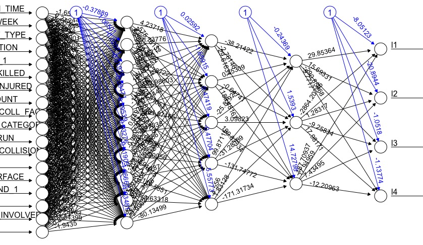

There were 639 accidents car crashes in El Centro for the past five years; the most of any Imperial Valley city. The least number of accidents were in Westmorland at 5 followed by Holtville at 7.

This graph depicts the severity of accidents in each city, from one being fatal to four being non-visible/complaints of pain. The most fatal accidents occurred in El Centro with 13 casualties over the past five years.

Most crashes from minor to fatal occurred when the weather was clear or cloudy. There were 2,905 crashes when the weather was clear.

The most accidents occurred on the weekdays with Friday being the worst. There have been 554 crashes on Fridays with 25 crashes resulting in a fatality.

1,186 crashes occurred in the afternoon regardless of severity. However. more fatalities occurred in the evening than afternoon.

The highest correlation was between a city and its population that determined how many accidents occurred. More car crashes occurred in higher populated cities. The next highest correlation was between lighting and alcohol involved accidents.

