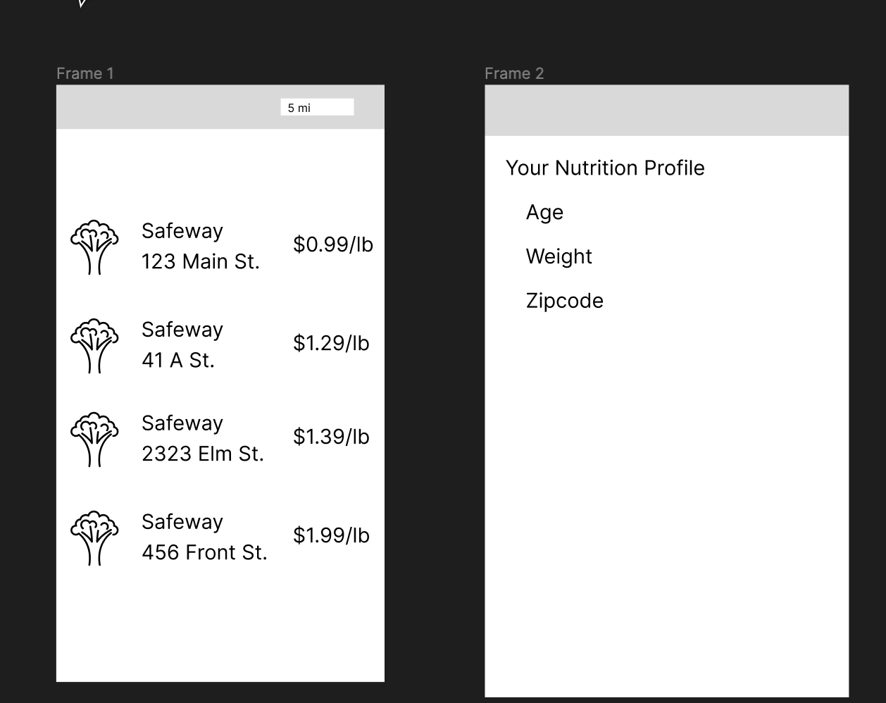

### 2022 BIG DATA HACKATHON PROPOSAL FORM

#### Team Number: `404`

#### Team Name: `Error 404`

#### Your team’s hackathon idea in One sentence:

##### `Food price aggregator for nutritionally at risk homes`

#### A visual

#### Hackathon Theme(s) (check a box(es))

- [] Artificial Intelligence/Machine Learning
  > How can we leverage AI/ML Algorithms to help support diagnostics, clinical decisions, and forecast staffing and hospital capacity?
- [x] Mobile
  > Designing Mobile Apps to improve user experience before, during, and after a healthcare visit.
- [x] Patient experience
  > How do you incorporate the patient perspective through the intersection of patient, provider, and community data into care plans.
- [x] Health Disparities
  > What is the role of big data and analytics in addressing health disparities among vulnerable and minority populations in San Diego County.
- [] Privacy and Security
  > How can we increase data privacy and enhance cybersecurity measures in the release, exchange and use of healthcare data, both locally and nationally.

#### Team Coordinator GitHub Username: `Dylan Simowitz`

#### Team Members `Dylan Simowitz, Mario Sanguinet, Christian Rodriguez, Eunjin Park, German Corea`
